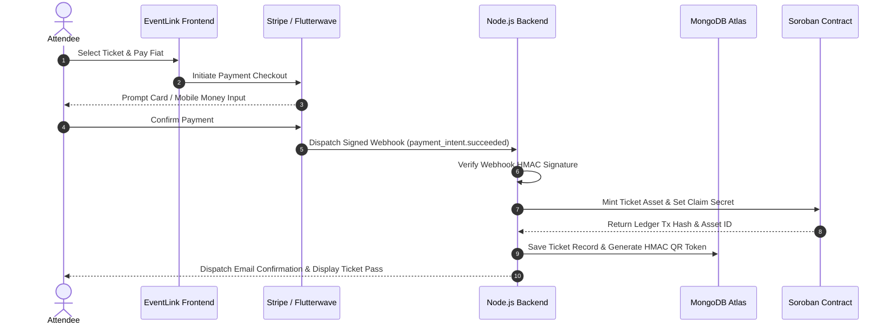
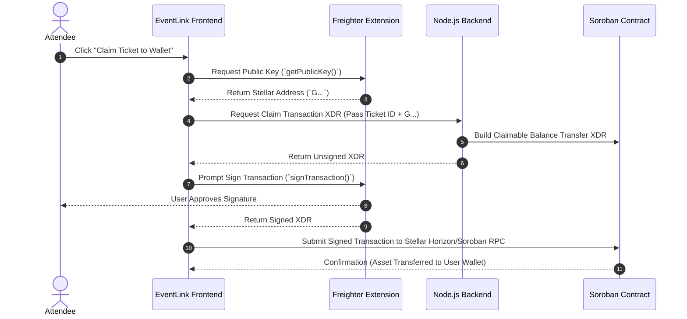

# 🏗️ EventLink — System Architecture & Technical Specifications

This document outlines the detailed system architecture, database schema, payment flow state machines, cryptographic verification models, and smart contract structures powering **EventLink**.

---

## 📐 High-Level System Architecture

EventLink uses a decoupled, event-driven hybrid architecture:

```
┌────────────────────────────────────────────────────────────────────────────────┐
│                                 FRONTEND LAYER                                 │
│ React 18 SPA | Vite | TypeScript | Glassmorphism UI | @stellar/freighter-api    │
└────────────────────────────────────────────────────────────────────────────────┘
          │                                                   │
   REST API / HTTP                                     Extension RPC
          │                                                   │
          ▼                                                   ▼
┌────────────────────────────────────────┐          ┌────────────────────────────┐
│             BACKEND LAYER              │          │     CLIENT WEB3 WALLET     │
│ Node.js | Express | TypeScript | JWT  │          │ Freighter / Albedo / xBull │
└────────────────────────────────────────┘          └────────────────────────────┘
     │               │              │                             │
     │ Webhook       │ Mongoose     │ Stellar SDK                 │ Direct Claim
     ▼               ▼              ▼                             ▼
┌──────────┐   ┌───────────┐   ┌─────────────────────────────────────────────────┐
│ PAYMENTS │   │ DATABASE  │   │                BLOCKCHAIN LAYER                 │
│ Stripe   │   │ MongoDB   │   │ Stellar Testnet & Soroban Smart Contracts       │
│ Flutterw.│   │ Atlas     │   │ Contract ID: CDD3...JHQK47J                     │
└──────────┘   └───────────┘   └─────────────────────────────────────────────────┘
```

---

## 🔄 Sequence Diagrams

### 1. Web2 Fiat Purchase & Invisible Onboarding Flow



### 2. Web3 Self-Custody Claim Flow



---

## 🗄️ Database Schema (MongoDB / Mongoose)

### Backend Ticket Schema

See the ticket schema in [EVENT_LINK_BACKEND-](https://github.com/orbit-flow-labs/EVENT_LINK_BACKEND-).

```typescript
interface ITicket {
  _id: string;
  eventId: string;
  ticketTier: string;
  buyerEmail: string;
  buyerName: string;
  paymentGateway: 'stripe' | 'flutterwave' | 'crypto';
  paymentId: string;
  status: 'minted' | 'claimed' | 'scanned';
  custodialPublicKey: string; // Temporary Stellar account G...
  claimedPublicKey?: string; // User's Freighter G... account
  claimSecret: string; // Unique secret token
  sorobanAssetId: string;
  qrPayload: string; // Cryptographic HMAC SHA-256 payload
  isScanned: boolean;
  scannedAt?: Date;
  poapMinted: boolean;
  createdAt: Date;
}
```

---

## 🔒 Cryptographic Gate Verification Model

To ensure gate safety even during internet outages, EventLink utilizes a dual-mode verification pipeline:

### 1. Online Validation
- Scanner sends QR payload to `POST /api/tickets/validate`.
- Backend verifies HMAC SHA-256 signature using `QR_SECRET`.
- Database checks `isScanned` status. If false, marks `isScanned: true` and executes Soroban check-in contract method.

### 2. Offline Fallback Validation
- Scanner decodes local JSON payload:
  `{ ticketId, eventId, buyerHash, timestamp, signature }`
- Scanner recalculates HMAC SHA-256 signature using cached event key.
- If valid and timestamp < event expiration, access is granted and check-in is queued in LocalStorage sync buffer.

---

## 📜 Soroban Smart Contract Functions

The Soroban source and contract CI are maintained in [EVENT_LINK_CONTRACT](https://github.com/orbit-flow-labs/EVENT_LINK_CONTRACT).

The Rust Soroban contract exposes the following core entry points:

- `initialize(admin: Address, fee_recipient: Address)`: Configures protocol authority and 5% organizer royalty destination.
- `mint_ticket(to: Address, event_id: Symbol, tier: Symbol) -> u64`: Mints ticket pass and assigns unique asset ID.
- `claim_ticket(ticket_id: u64, new_owner: Address)`: Transfers ownership from temporary backend custodian to user's Web3 wallet.
- `check_in(ticket_id: u64)`: Marks ticket consumed on-chain and triggers POAP badge minting.
