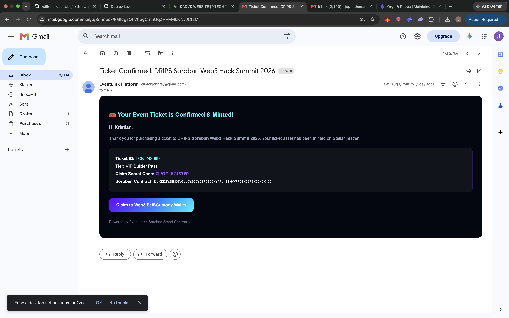
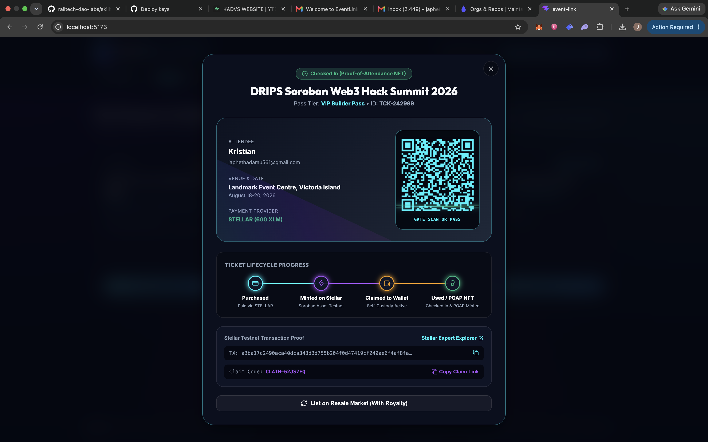

# 🎟️ EventLink — Full-Stack Web2 + Web3 Event Ticketing Platform

> **Seamless Web2 fiat onboarding meets true Web3 digital asset ownership for event ticketing, powered by Stellar & Soroban.**

[](https://stellar.org)
[](https://soroban.stellar.org)
[](#fiat-payment-gateways)
[](https://opensource.org/licenses/MIT)

---

## 📌 Executive Summary

**EventLink** is the EventLink frontend. The current checkout simulates Stripe and Flutterwave payment references in the browser; it does not charge a card or mobile-money account. The API is maintained separately in [EVENT_LINK_BACKEND-](https://github.com/orbit-flow-labs/EVENT_LINK_BACKEND-), and Soroban source is in [EVENT_LINK_CONTRACT](https://github.com/orbit-flow-labs/EVENT_LINK_CONTRACT).

Upon purchase, the system automatically mints a non-custodial digital ticket asset on the Stellar ledger, generates an offline-resilient QR code, and establishes a claimable balance. Attendees can optionally connect a **Freighter**, **Albedo**, **xBull**, or **Lobstr** wallet at any time to claim full self-custody over their on-chain ticket passes and post-event Proof-of-Attendance NFTs (POAPs).

---

## ⚡ Live Deployed Infrastructure & Smart Contracts

- **Deployed EventLink Project**: https://event-link-soroban.vercel.app/
- **Blockchain Network**: Stellar Testnet
- **Deployed Soroban Smart Contract ID**: [`CDD3VJENDGV6LLOY2OCYQSRD5CQKYAPL4I3MNWFFQBXJ6P6KOJHQK47J`](https://stellar.expert/explorer/testnet/contract/CDD3VJENDGV6LLOY2OCYQSRD5CQKYAPL4I3MNWFFQBXJ6P6KOJHQK47J)
- **StellarExpert Explorer**: [View Live Contract Details](https://stellar.expert/explorer/testnet/contract/CDD3VJENDGV6LLOY2OCYQSRD5CQKYAPL4I3MNWFFQBXJ6P6KOJHQK47J)
- **Primary Wallet Integration**: Freighter Browser Extension (`@stellar/freighter-api`) + Albedo Web Signer

---

## 🚨 Problem Statement

Traditional event ticketing platforms suffer from severe structural failures that cost event organizers and attendees billions annually:

1. **Ticket Fraud & Counterfeiting:** Static PDF tickets and static QR code screenshots are easily duplicated, resold, and spoofed, leading to gate entry conflicts and financial losses.
2. **Unregulated Scalping & Exploitative Secondary Markets:** Scalpers buy tickets in bulk using bots and resell them at 300%–500% markups without returning any revenue or royalties to original event creators.
3. **Lack of True Asset Ownership:** Users do not own their tickets; centralized platforms lock passes inside proprietary apps, erase tickets post-event, and prevent seamless peer-to-peer transfers.
4. **High Web3 Friction:** Existing decentralized ticketing applications require attendees to understand gas fees, seed phrases, network switches, and crypto wallets *before* buying a single ticket.

---

## 💡 Solution

EventLink solves these friction points through a progressive onboarding architecture:

- **Invisible Web2 Onboarding:** Users buy tickets in USD or NGN using credit cards, Apple Pay, Google Pay, or Mobile Money via Stripe & Flutterwave.
- **Automated Soroban Minting:** Backend webhooks instantly trigger Soroban smart contract functions to mint verifiable ticket passes on Stellar.
- **Self-Custody on Demand:** Non-crypto users receive instantaneous QR code tickets via web and email. Web3-native users can connect **Freighter** to claim asset ownership into self-custody.
- **Cryptographic Gatekeeper Scanner:** Organizers scan HMAC-SHA256 signed dynamic QR codes, preventing double-entry and verifying ledger state in real time (with an offline fallback engine).
- **Post-Event Proof-of-Attendance (POAP):** Gate check-in converts the ticket pass into a digital collectible POAP, rewarding attendees with on-chain LINK tokens and event vouchers.

---

##  Key Features

- **Multi-Gateway Fiat Payments:** Seamless checkout powered by Stripe (USD) and Flutterwave (NGN/GHS/KES).
- **Stellar Soroban Smart Contracts:** Custom Rust contract handling ticket creation, inventory tracking, ownership claims, and check-in status.
- **Native Freighter & Web3 Wallet Support:** Real browser extension interaction for wallet signature verification and asset claiming.
- **Offline-Capable Scanner Terminal:** Gatekeeper scanner operates online via REST API or offline using cryptographic payload verification.
- **Post-Event Attendance Rewards:** Automatic issuance of POAP NFTs, 150 LINK reward tokens, and 20% discount vouchers upon check-in.
- **Secret Organizer Admin Portal (`/admin`):** Dashboard for event publishing, live sales telemetry, analytics, and gate scanner controls.

---

## 🔄 How It Works (Step-by-Step Flow)

```
┌─────────────┐      1. Purchase Ticket     ┌─────────────────┐      2. Process Fiat      ┌─────────────────────┐
│  Attendee   │ ──────────────────────────> │    EventLink    │ ────────────────────────> │ Stripe / Flutterwave│
└─────────────┘                             │    Frontend     │                           └─────────────────────┘
       │                                    └─────────────────┘                                      │
       │                                                                                             │ 3. Webhook Signal
       │                                                                                             ▼
       │ 6. View QR / Claim Wallet          ┌─────────────────┐      5. Save Metadata     ┌─────────────────────┐
       └─────────────────────────────────── │ MongoDB Database│ <──────────────────────── │   Node.js Backend   │
                                            └─────────────────┘                           └─────────────────────┘
                                                                                                     │
                                                                                                     │ 4. Execute Mint
                                                                                                     ▼
┌─────────────┐                       7. Gatekeeper QR Scan                               ┌─────────────────────┐
│ Event Staff │ ────────────────────────────────────────────────────────────────────────> │   Stellar Network   │
└─────────────┘                                                                           └─────────────────────┘
```

1. **Browse & Select:** Attendee chooses an event and ticket tier on the EventLink UI.
2. **Fiat Checkout:** Attendee pays via Stripe or Flutterwave without needing a crypto wallet.
3. **Webhook Processing:** Payment gateway notifies Node.js backend of successful payment.
4. **Soroban Contract Minting:** Backend interacts with Soroban contract `CDD3...JHQK47J` to mint the ticket asset and set up claim balances.
5. **QR & Pass Generation:** An HMAC-SHA256 signed QR code is generated, stored in MongoDB, and delivered via email.
6. **Wallet Claiming (Optional):** Attendee can connect Freighter wallet to transfer the Soroban asset directly to their public key (`G...`).
7. **Gate Verification:** Event staff scan the QR code at venue entry. The system validates the signature, marks the ticket scanned on-chain, and issues POAP rewards.

---

## 🏗️ System Architecture

- **Frontend:** React 19, TypeScript, Vite, Glassmorphism CSS, `@stellar/freighter-api`, Lucide Icons.
- **Backend:** Node.js, Express, TypeScript, Mongoose ODM, JWT Authentication.
- **Database:** MongoDB Atlas (Cluster `event-link.dmfso1e.mongodb.net`).
- **Blockchain Layer:** Stellar Testnet, Soroban Rust Smart Contracts, `@stellar/stellar-sdk`.
- **Payment Gateways:** Stripe API, Flutterwave Webhooks.

---

## 💻 Tech Stack

| Domain | Technology |
| :--- | :--- |
| **Smart Contracts** | Rust, Soroban SDK, Stellar CLI |
| **Blockchain Client** | `@stellar/stellar-sdk`, Soroban RPC |
| **Frontend** | React 19, Vite, TypeScript, Framer Motion |
| **Styling** | Vanilla CSS (Dark Neon Glassmorphism) |
| **Backend API** | Node.js, Express, TypeScript, tsx |
| **Database** | MongoDB Atlas, Mongoose |
| **Payments** | Stripe API, Flutterwave Node SDK |
| **Wallets** | Freighter API, Albedo, xBull, Lobstr |

---

## 🎨 UI/UX Design System

- **Dark Obsidian Aesthetics:** Deep dark theme (`#0b0d17`) with vibrant neon cyan (`#00f2fe`) and ultraviolet (`#7000ff`) gradients.
- **Glassmorphism:** Translucent panels with background blur effects (`backdrop-filter: blur(16px)`).
- **Interactive Ticket Cards:** 3D hover effects, dynamic badge status indicators, and smooth flip animations showing QR credentials.
- **Responsive Dashboard:** Sleek navigation for viewing active passes, claimed Web3 collectibles, and check-in rewards.

---

## 🖼️ Screenshots


*Figure 1: EventLink landing page displaying featured events and search filters.*


*Figure 2: Fiat payment modal supporting Stripe card payments and Flutterwave local options.*


*Figure 3: User dashboard showing interactive ticket passes, QR codes, and Freighter claim controls.*


*Figure 4: Automated email delivery containing digital ticket credentials and claim links.*


---

## 🔑 Environment Variables

Copy `.env.example` to `.env`. `VITE_API_BASE_URL` is a frontend build-time setting; use the local backend URL for development or the deployed [EVENT_LINK_BACKEND-](https://github.com/orbit-flow-labs/EVENT_LINK_BACKEND-) URL in production. Backend secrets and database settings belong in the backend repository, not this frontend project.

---

## 🚀 Installation & Setup

### 1. Clone Repository

```bash
git clone https://github.com/orbit-flow-labs/EVENT_LINK.git
cd EVENT_LINK
```

### 2. Install Dependencies

```bash
npm install
```

### 3. Configure Environment

```bash
cp .env.example .env
# Update .env with your database and API credentials
```

### 4. Start the Frontend Application

```bash
npm run dev
```

Visit `http://localhost:5173` in your browser. API-backed features require the separate [backend](https://github.com/orbit-flow-labs/EVENT_LINK_BACKEND-) running at `http://localhost:3001`.

---

## 🌐 Deployment Guidelines

- **Frontend:** Deployed via [Vercel](https://vercel.com) with Vite build environment.
- **Backend:** Maintained in [EVENT_LINK_BACKEND-](https://github.com/orbit-flow-labs/EVENT_LINK_BACKEND-); deploy via [Render](https://render.com) or [Railway](https://railway.app).
- **Soroban contract:** Maintained in [EVENT_LINK_CONTRACT](https://github.com/orbit-flow-labs/EVENT_LINK_CONTRACT).
- **Database:** Hosted on [MongoDB Atlas](https://www.mongodb.com/cloud/atlas).
- **SSL / Domain:** Production requires HTTPS for WebCrypto APIs, payment webhooks, and Freighter wallet interactions.

---

## 👛 Wallet Integration

EventLink natively interfaces with the **Freighter Wallet** browser extension:

```javascript
import { isConnected, getPublicKey, signTransaction } from "@stellar/freighter-api";

export async function claimTicketToFreighter(xdr) {
  if (!(await isConnected())) {
    throw new Error("Freighter wallet is not installed.");
  }
  const userPublicKey = await getPublicKey();
  const signedXdr = await signTransaction(xdr, { network: "TESTNET" });
  return signedXdr;
}
```

---

## 🔒 Security Considerations

- **HMAC Signature Verification:** Stripe and Flutterwave webhooks are validated using cryptographic secret hashes before processing orders.
- **Secret Key Isolation:** Blockchain issuer keys and database credentials are preserved strictly on server-side environment configurations.
- **Dynamic Signed QR Payload:** Gate scanner payloads use HMAC SHA-256 signatures with nonce timestamps to block screenshot replay attacks.

---

## 🚀 Future Roadmap

- **Smart Contract P2P Ticket Resale:** Peer-to-peer secondary ticket marketplace with capped resale prices and forced creator royalties.
- **Dynamic Tier Pricing:** Automated algorithmic tier price adjustments based on sales velocity and demand.
- **Cross-Chain Bridge Support:** Interoperability extensions connecting Stellar assets with EVM networks.

---


## 📜 License

Distributed under the **MIT License**. See `LICENSE` for details.
