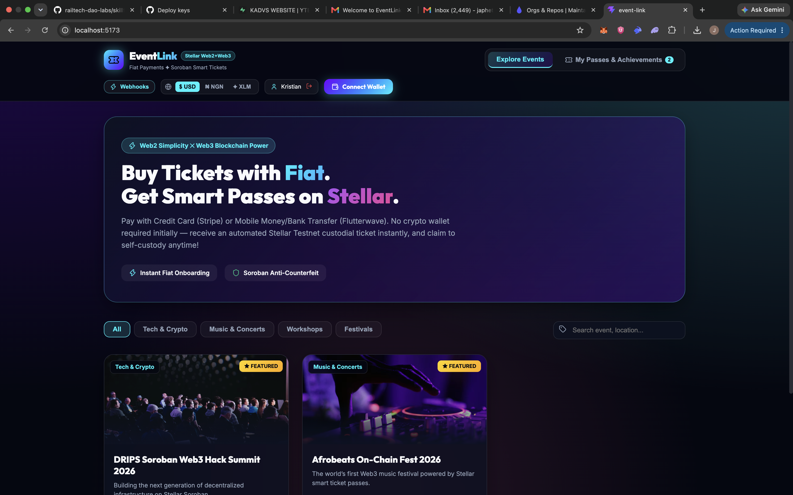
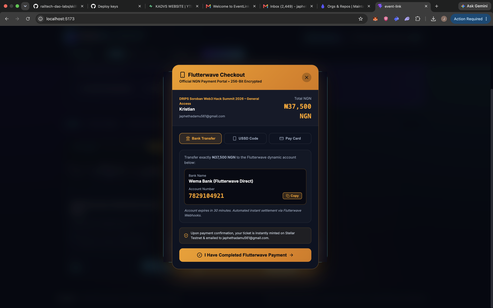
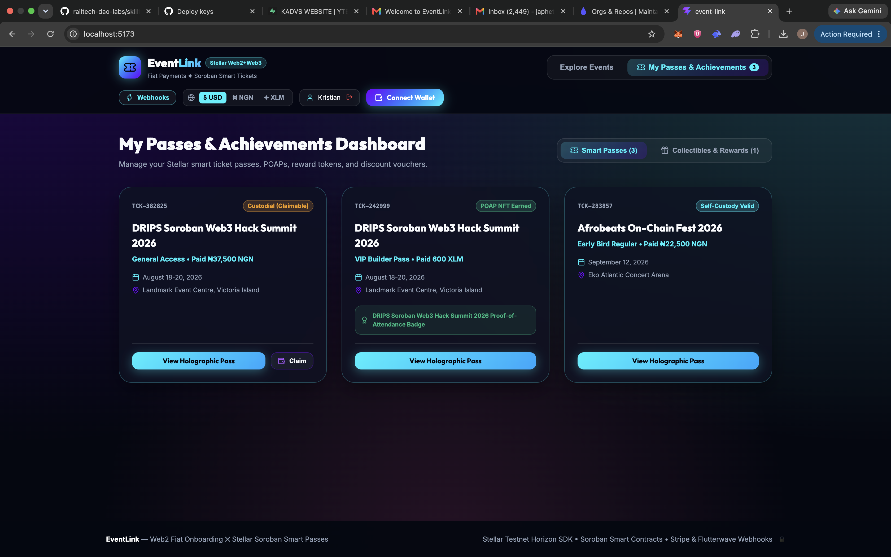

# EventLink

**An open-source event ticketing prototype with a React frontend, a Node.js API, and a Stellar Soroban contract.**

[](https://github.com/orbit-flow-labs/EVENT_LINK/actions/workflows/ci.yml)
[](LICENSE)

> **Status:** EventLink is a prototype. Checkout currently simulates Stripe and Flutterwave payment references; it does not collect or charge card or mobile-money details. Blockchain functionality targets Stellar Testnet. Do not use it to handle production payments or tickets without further security review.

## Project repositories

| Repository | Responsibility | Main technologies |
| --- | --- | --- |
| [EVENT_LINK](https://github.com/orbit-flow-labs/EVENT_LINK) | Web frontend | React, TypeScript, Vite |
| [EVENT_LINK_BACKEND-](https://github.com/orbit-flow-labs/EVENT_LINK_BACKEND-) | REST API, persistence, webhook handlers, email | Node.js, Express, MongoDB, Stellar SDK |
| [EVENT_LINK_CONTRACT](https://github.com/orbit-flow-labs/EVENT_LINK_CONTRACT) | Soroban ticket contract | Rust, Soroban SDK |

## What you can explore

- Browse mock and API-backed events, inspect ticket tiers, and open checkout flows.
- View ticket passes, connect supported Stellar wallets, and try the claim flow.
- Explore the organizer dashboard and scanner interface, including online and offline-demo states.
- Follow ticket metadata between the frontend, backend API, and Soroban Testnet integration.

Provider checkout references, in-memory fallback storage, and some Stellar transaction paths are demonstration behavior. The project does not currently provide a complete production payment settlement system.

## Screenshots

| Event discovery | Checkout | Ticket passes |
| --- | --- | --- |
|  |  |  |

## Run the frontend

### Requirements

- Node.js 22 or newer
- npm

```sh
git clone https://github.com/orbit-flow-labs/EVENT_LINK.git
cd EVENT_LINK
npm ci
cp .env.example .env
npm run dev
```

Open `http://localhost:5173`. Set `VITE_API_BASE_URL` in `.env` if the API is not at its local default (`http://localhost:3001`). This value is embedded at frontend build time; use the deployed backend URL when building for deployment.

### Run the API locally

In another terminal, clone and start the backend:

```sh
git clone https://github.com/orbit-flow-labs/EVENT_LINK_BACKEND-.git
cd EVENT_LINK_BACKEND-
npm ci
cp .env.example .env
npm run dev
```

MongoDB is optional for local development; without it, the backend uses an in-memory store that resets when the process stops. See the backend README for environment settings and API routes.

### Work on the contract

The Rust contract is maintained separately. Install Rust 1.86.0, `rustfmt`, the `wasm32-unknown-unknown` target, and Stellar CLI, then follow the setup and Testnet deployment steps in [EVENT_LINK_CONTRACT](https://github.com/orbit-flow-labs/EVENT_LINK_CONTRACT).

## Frontend commands

```sh
npm ci
npm run dev
npm run lint
npm run build
npm run preview
```

Pull requests run the frontend lint and production build in GitHub Actions. Backend and contract checks run in their own repositories.

## Configuration

This repository only needs the frontend API URL:

| Variable | Purpose | Local default |
| --- | --- | --- |
| `VITE_API_BASE_URL` | API origin used by browser requests | `http://localhost:3001` |

Keep database, JWT, SMTP, and payment-provider secrets in the backend deployment environment. Never put secrets in `VITE_*` variables: those values are public in the browser bundle.

## Contributing

Contributions are welcome. For Drips Wave 10 or other program-linked work, use the program's current repository and submission rules and reference the relevant task or issue in your pull request. This README does not imply official program sponsorship or acceptance.

1. Check the open issues or discuss a substantial change before starting.
2. Keep changes focused in the repository that owns the behavior: frontend, backend, or contract.
3. Include the issue/task reference, concise rationale, and test steps in the PR description.
4. Run the relevant checks: frontend `npm run lint` and `npm run build`; backend `npm run typecheck`; contract `cargo fmt -- --check`, `cargo test`, and the WASM build.
5. For UI changes, include screenshots at a representative desktop or mobile size. Never commit credentials, production data, or real attendee information.

## Security

Please report security concerns privately to the maintainers rather than publishing exploit details in an issue. Backend secrets and contract deployment keys must remain outside this repository. See the [security policy](SECURITY.md).

## License

MIT. See [LICENSE](LICENSE).
